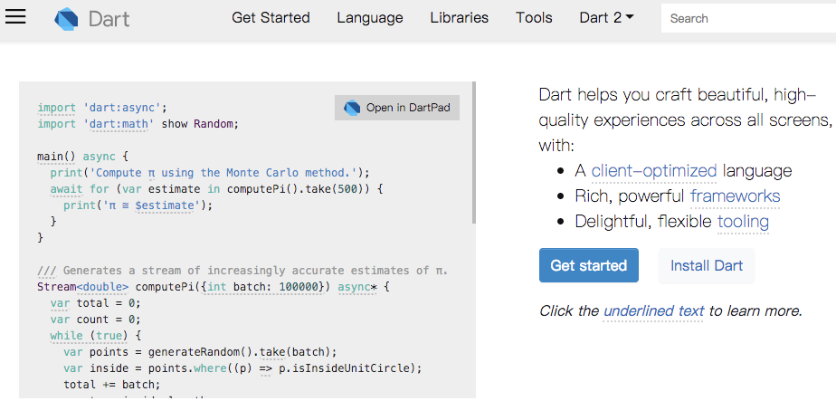
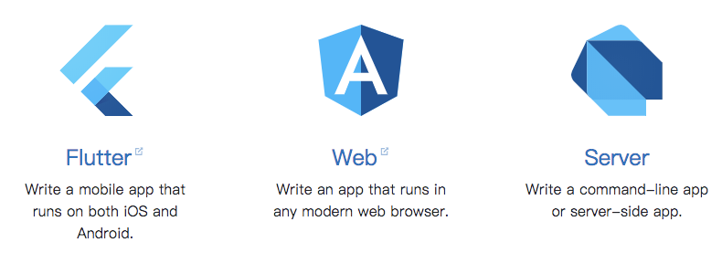
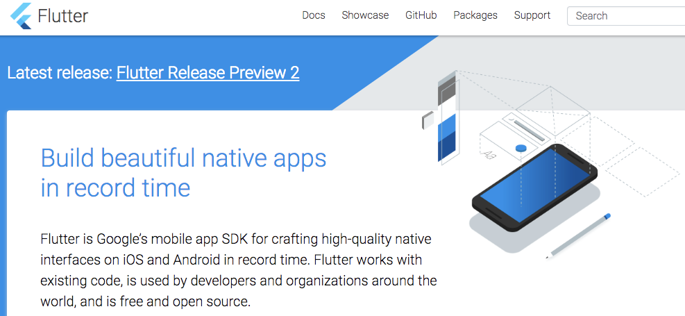

# Dart

[dartlang.org](https://www.dartlang.org/)

# 能用来做什么

## 多平台开发

## Flutter

[flutter.io](https://flutter.io/)

# 大纲

# 参考

- [官网](https://www.dartlang.org/)
- [2018 Google 开发者大会](http://www.google.cn/events/developerdays2018/)
- [bilibili](https://space.bilibili.com/64169458/#/)

---

© 猫哥
微信 ducafecat
[ducafecat.tech](https://ducafecat.tech/)
