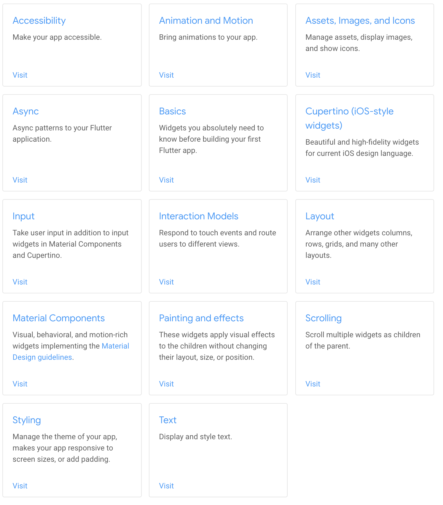

## 本节目标

- 整体架构设计
- 层次分类

## 整体架构设计

### 架构图

### 源码目录

.../sdk/flutter/packages/flutter/lib

### 目录功能

| 名称       | 说明                                                         |
| ---------- | ------------------------------------------------------------ |
| Foundation | 基础部分                                                     |
| Animation  | 动画                                                         |
| Painting   | 边框绘制、颜色、裁剪图像处理、画笔、插值器等跟绘制、图像、装饰相关的类 |
| Gestures   | 事件类、长按、触摸、放大等等                                 |
| Rendering  | 渲染 Widget 的基础库                                         |
| Widget     | 依赖 Rendering 层进行构建，Widget 是 Flutter 的核心          |
| Material   | Android 平台的风格                                           |
| Cupertino  | iOS 平台风格的扁平化                                         |

## widget 分类

### 主要分为 StatelessWidget 和 StatefulWidget

### 官方分类

- 基础组件 Widget（Basics）：

  Container、Row、Column、Image、Text、Icon、RaisedButton、Scaffold、Appbar、FlutterLogo、Placeholder

- Material Components：

- App 结构和导航类

  Scaffold、Appbar、BottomNavigationBar、TabBar、TabBarView、MaterialApp、WidgetsApp、Drawer、SliverAppBar

- 按钮类

  RaisedButton、FloatingActionButton、FlatButton、IconButton、DropdownButton、PopupMenuButton、ButtonBar

- 输入和选择类

  TextField、Checkbox、Raido、Switch、Slider、Date&Time Pickers

- 对话框和控制面板类

  SimpleDialog、AlertDialog、BottomSheet、ExpansionPanel、SnackBar）；

  信息显示类（Image、Icon、Chip、Tooltip、DataTable、Card、LinearProgressIndicator、CircularProgressIndicator、GridView

- 布局类

  ListTile、Stepper、Divider

- Cupertino （iOS-style widgets）：

  CupertinoActionSheet、CupertinoActivityIndicator、CupertinoAlertDialog、CupertinoButton、CupertinoDatePicker、CupertinoDialog、CupertinoDialogAction、CupertinoFullscreenDialogTransition、CupertinoPageScaffold、CupertinoPageTransition、CupertinoPicker、CupertinoPopupSurface、CupertinoSegmentedControl、CupertinoSlider、CupertinoSwitch、CupertinoNavigationBar、CupertinoTabBar、CupertinoTabScaffold、CupertinoTabView、CupertinoTextField、CupertinoTimerPicker

- Layout：

- 单个子元素的布局 Widget

  Container、Padding、Center、Align、FittedBox、AspectRatio、ConstrainedBox、Baseline、FractionallySizedBox、IntrinsicHeight、IntrinsicWidth、LimitedBox、Offstage、OverflowBox、SizedBox、SizedOverflowBox、Transform、CustomSingleChildLayout

- 多个子元素的布局 Widget

  Row、Column、Stack、IndexedStack、GridView、Flow、Table、Wrap、ListBody、CustomMultiChildLayout、LayoutBuilder、ListView、Expanded

- Text 文本显示类：

  Text、RichText、DefaultTextStyle

- Assets、图片、Icons 类：

  Image、Icon、RawImage、AssetBundle

- Input 输入类：

  Form、FormField、RawKeyboardListener

- 动画和 Motion 类：

  AnimatedContainer、AnimatedCrossFade、Hero、AnimatedBuilder、DecoratedBoxTransition、FadeTransition、PositionedTransition、RotationTransition、ScaleTransition、SizeTransition、SlideTransition、AnimatedDefaultTextStyle、AnimatedListState、AnimatedModalBarrier、AnimatedOpacity、AnimatedPhysicalModel、AnimatedPositioned、AnimatedSize、AnimatedWidget、AnimatedWidgetBaseState

- 交互模型类：

- 触摸交互

  Draggable、LongPressDraggable、GestureDetector、DragTarget、Dismissible、IgnorePointer、AbsorbPointer、Scrollable

- 路由导航

  Hero、Navigator

- 样式类：

  Padding、Theme、MediaQuery

- 绘制和效果类：

  Transform、Opacity、DecoratedBox、FractionalTranslation、RotatedBox、ClipOval、ClipPath、ClipRect、CustomPaint、BackdropFilter

- Async 异步模型类：

  FutureBuilder、StreamBuilder

- 滚动类：

  GridView、ListView、NestedScrollView、SingleChildScrollView、Scrollable、Scrollbar、CustomScrollView、NotificationListener、ScrollConfiguration、RefreshIndicator、PageView

- 辅助功能类：

  Semantics、MergeSemantics、ExcludeSemantics

### widget 地图

## 参考

- [Widget catalog](https://flutter.dev/docs/development/ui/widgets)

---

© 猫哥

[https://ducafecat.tech](https://ducafecat.tech/)
